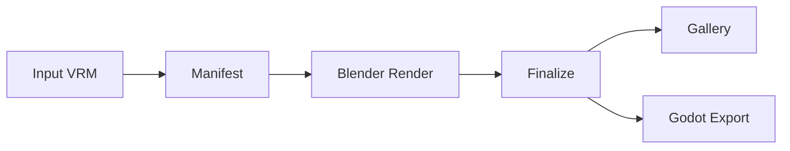

# VRM Automation

[](LICENSE)

Headless Blender scaffold for automating VRM character workflows. Import, inspect, rig, fit accessories, animate, render QA, lip-sync, and export to Godot — all orchestrated through Docker Compose with image-guided accessory calibration powered by SAM 3.1 + Qwen.

## Pipeline



## Key Features

- **Accessory Placement** — Image-guided calibration with SAM 3.1 + Qwen for deterministic, reproducible accessory positioning
- **Lip-Sync** — Text-to-speech, Rhubarb phoneme alignment, and VRM viseme timelines for talking characters
- **MuseTalk** — Optional 2D audio-driven talking-video preview backend
- **Godot Integration** — Runtime control API, GLB loading, animation playback, and `.tscn` game-asset export
- **Batch Pipeline** — Manifest-driven renders with GLB optimization, QA scoring, and gallery generation
- **Four Runtimes** — Blender (headless), host Python, Godot, and webapp, wired together via Compose profiles

## Quick Start

```bash
# Clone and set up
git clone https://github.com/your-org/vrm_automation.git
cd vrm_automation
cp .env.example .env

# Download Blender add-ons
docker compose --profile tools run --rm download-addons

# Build the Blender container
docker compose build blender-vrm

# Run a single character through the pipeline
INPUT_MODEL=/workspace/input/model.vrm \
docker compose --profile tools run --rm animate-smoke
```

## Runtimes

| Runtime | Role | Port |
|---------|------|------|
| **Blender** | VRM import, rig inspection, outfit fitting, animation, GLB/VRM export, PNG QA | — |
| **Host Python** | Orchestration, manifest building, batch coordination, speech/lip-sync, calibration | — |
| **Godot** | Runtime control API, GLB loading, animation playback, expression/lip-sync, game-asset export | `:8790` |
| **Webapp** | Review/QA UI, batch job coordinator, character browser | `:8780` |

## Testing

```bash
# Unit tests (no Blender required)
python3 -m unittest discover -s tests

# Local quality gate
./scripts/run_checks.sh
```

## Documentation

- [Accessory Attachment Standard](docs/accessory_attachment_standard.md) — placement pipeline and calibration loop
- [MuseTalk Integration](research/musetalk_integration.md) — upstream requirements and adapter details
- [CLAUDE.md](CLAUDE.md) — architecture guide and development conventions

## License

[MIT](LICENSE)
