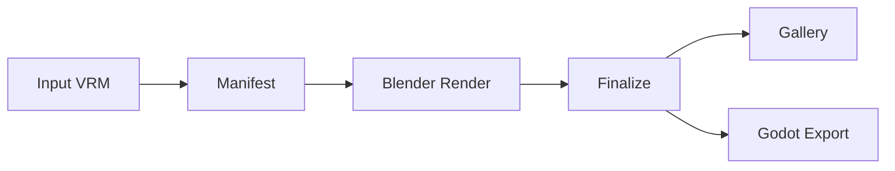

# VRM Automation

[](./LICENSE)
[](https://hub.docker.com/)
[](https://www.python.org/)
[](https://www.blender.org/)
[](./tests/)

Headless Blender scaffold for automating VRM character workflows. **From raw model to talking game-ready character** -- import, inspect, rig, fit accessories, animate, render QA, lip-sync, and export to Godot, all orchestrated through Docker Compose with image-guided accessory calibration powered by SAM 3.1 + Qwen.

---

## Pipeline



## Features

| Capability | Description |
|-----------|-------------|
| **Accessory Placement** | Image-guided calibration with SAM 3.1 + Qwen for deterministic, reproducible positioning |
| **Lip-Sync** | Text-to-speech, Rhubarb phoneme alignment, and VRM viseme timelines |
| **MuseTalk** | Optional 2D audio-driven talking-video preview backend |
| **Godot Integration** | Runtime control API, GLB loading, animation playback, `.tscn` game-asset export |
| **Batch Pipeline** | Manifest-driven renders with GLB optimization, QA scoring, gallery generation |
| **Four Runtimes** | Blender, host Python, Godot, webapp -- wired via Compose profiles |

## Runtimes

| Runtime | Role | Port |
|---------|------|------|
| **Blender** | VRM import, rig inspection, outfit fitting, animation, GLB/VRM export, PNG QA | -- |
| **Host Python** | Orchestration, manifest building, batch coordination, speech/lip-sync, calibration | -- |
| **Godot** | Runtime control API, GLB loading, animation playback, expression/lip-sync, game-asset export | `:8790` |
| **Webapp** | Review/QA UI, batch job coordinator, character browser | `:8780` |

## Quick Start

```bash
git clone https://github.com/jajmangold/vrm_automation.git
cd vrm_automation
cp .env.example .env

# Download Blender add-ons
docker compose --profile tools run --rm download-addons

# Build the Blender container
docker compose build blender-vrm

# Run a single character through the pipeline
INPUT_MODEL=/workspace/input/model.vrm \
docker compose --profile tools run --rm animate-smoke
```

## Testing

```bash
# Unit tests (no Blender required)
python3 -m unittest discover -s tests

# Local quality gate
./scripts/run_checks.sh
```

## Documentation

| Document | Purpose |
|----------|---------|
| [`docs/accessory_attachment_standard.md`](docs/accessory_attachment_standard.md) | Placement pipeline and calibration loop |
| [`research/musetalk_integration.md`](research/musetalk_integration.md) | Upstream requirements and adapter details |
| [`CLAUDE.md`](CLAUDE.md) | Architecture guide and development conventions |

## Contributing

Issues and PRs welcome. Run `./scripts/run_checks.sh` before submitting.

## License

[MIT](LICENSE)
